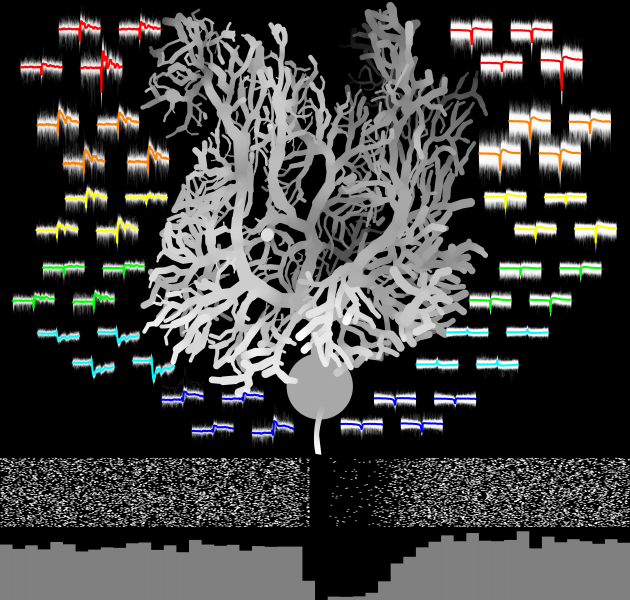

# CUSP


[](#citation)
[](LICENSE.md) 

This repository is the official implementation for the paper: 

**"CUSP: Complex Spike Sorting from Multi-electrode Array Recordings with U-net Sequence-to-Sequence Prediction"**.

You can access the published paper here:
[https://doi.org/10.1016/j.jneumeth.2025.110631](https://doi.org/10.1016/j.jneumeth.2025.110631)


## Example Usage
Once you have downloaded the repository, navigate to the directory and run the following command to install the package:

```bash
pip install .
```
You can start with example in `/examples/ex_run_CUSP.ipynb`. This Jupyter notebook demonstrates a customized class `CUSP_pipeline` for using CUSP, how to set up the parameters, load data, and read the complex spike sort results.

Model parameters:
- `fs`: sampling rate (Hz) of the recording (e.g., 30000). 
- `fs_ms`: sampling rate in kHz, should be `fs/1000` (e.g., 30).
- `N_ch`: number of channels in the recording (e.g., 128).
- `L_segment_batch`: batch number for model processing, can be increased with larger GPU memory (e.g., 64).
- `L_segment_len`: length of each segment for model processing, should be segment length in milliseconds * `fs_ms` (e.g., 20*`fs_ms`).
- `L_segment_step`: step size between segments for model processing, should be step size in milliseconds * `fs_ms` (e.g., 10*`fs_ms`).
- `L_segment_edge_discard`: number of samples to discard at each edge of the segment to avoid edge effects, should be in milliseconds * `fs_ms` (e.g., 2.5*`fs_ms`).

Clustering parameters:
- `CS_seg_ms`: pre and post window (in ms) around detected complex spike peaks for waveform extraction in clustering (e.g., [5,7]).
- `DBSCAN_eps`: epsilon parameter for DBSCAN clustering (e.g., 1).
- `CS_peak_sign`: sign of the assumed complex spike peak, -1 for negative peak, 1 for positive peak, only affect determining the window during waveform extraction (e.g., -1).
- `CS_detect_threshold_quantile`: quantile threshold for complex spike detection from model output probabilities (e.g., 0.7).
- `if_cluster_waveform`: boolean flag to indicate whether to perform clustering based on waveform features (True), or based on ACG (False) (e.g., True).
- `enable_plot`: boolean flag to enable/disable plotting the clustering results during processing (e.g., True).

Preprocessing parameters:
- `lfp_filt_order`: order of the bandpass filter for LFP filtering (e.g., 3).
- `lfp_filt_band`: frequency band for LFP filtering (e.g., [30,400]).
- `ap_filt_order`: order of the bandpass filter for AP filtering (e.g., 3).
- `ap_filt_band`: frequency band for AP filtering (e.g., [300,3000]).
- `ch_anchor`: anchor channel index for spatial referencing, if within `[1,N_ch]`, `CUSP_pipeline.forward()` will process only channels within 12 channels around the anchor channel; if set to -1, use `CUSP_pipeline.forward_CS_anchor_list()` will process all input channels sequentially.

Path parameters:
- `data_path`: path to the input binary data file (e.g., channel*sample .bin file with `int16` type).
- `model_path`: path to the pre-trained CUSP U-net model file (e.g., `src/CUSP/pretrained_model/CUSP_pretrained_model_20ms.pth`).

Output from `CUSP_pipeline.forward()`:
- `CS_peak_channel`: a list of detected complex spike peak channel indices for each detected complex spike cluster (e.g., [64,65,66]).
- `CS_clustered_x_idx`: a list of lists of detected complex spike peak time indices for each detected complex spike cluster (e.g., [[1],[1,3],[2]]).

Output from `CUSP_pipeline.forward_CS_anchor_list()`:
- `CS_peak_channel_list`: a list of `CS_peak_channel` corresponding to each anchor channel in input channel anchor list.
- `CS_clustered_x_idx_list`: a list of `CS_clustered_x_idx` corresponding to each anchor channel in input channel anchor list.
## Dataset

The data associated with this project has been officially published and is openly available for access and reuse. You can find the full, versioned dataset on **Zenodo** by following this link: [https://zenodo.org/records/17673850](https://zenodo.org/records/17673850).

## Citation

If you use the methods described in our paper or our published dataset, please cite the following publication:

Bao C, Mildren RL, Charles AS, Cullen KE. CUSP: Complex Spike Sorting from Multi-electrode Array Recordings with U-net Sequence-to-Sequence Prediction. **J Neurosci Methods**. 2025 Nov 18:110631. doi: 10.1016/j.jneumeth.2025.110631.

```bibtex
@article{Bao2025CUSP,
    title = {{CUSP: Complex Spike Sorting from Multi-electrode Array Recordings with U-net Sequence-to-Sequence Prediction}},
    author = {Bao, C and Mildren, RL and Charles, AS and Cullen, KE},
    journal = {{J Neurosci Methods}},
    year = {2025},
    month = {Nov 18},
    doi = {10.1016/j.jneumeth.2025.110631},
    publisher = {Elsevier},
}
```

---
